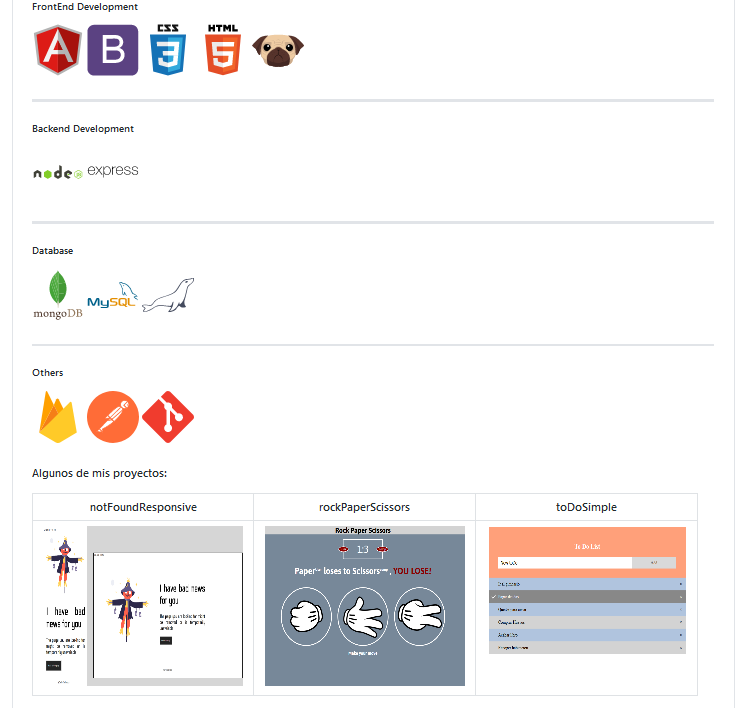

<!--  -->
## 🏡 Welcome! 👋 I hope my projects are to your liking :D
<span style="align:center"></span>
<!---
System.out.print.ln('Hello World!');

-->

## 👨‍💻About me
> ***Degree in computing & information technology in Cibertec and bachelor's degree in systems engineering at the UPC🎓🥇 . I'm RxJava 11 Programmer Angular & React Front End Developer and Azure DevOps. I have experience in technology companies in banking🏦, electronic invoicing🧾 and e-commerce 🛒***
***
## 🏗 My favorite Projects
```html
<!DOCTYPE HTML>
<html>
  <head>
    <title>My Favorite Projects</title>
  </head>
  <body>
    <div><h1>Thanks for your visit!</h1></div>
  </body>
</html>
```

❶ Website for an IT Consulting Company: [Million Consulting](https://github.com/nicolasbncruz/upc) (HTML, CSS, Javascript, Bootstrap, Angular, Node JS)  
❷ CV Online Personal Website: [Profesional Java](https://github.com/nicolasbncruz/webpage) (HTML, CSS, Javascript, Bootstrap)  
❸ Fitness Mobile App: [Make It Better Project](https://github.com/nicolasbncruz/makeitbetter) (Java for Android, Firebase)  
<!---❹ My favorite search engine is [Duck Duck Go](https://duckduckgo.com)  
❺ My favorite search engine is [Duck Duck Go](https://duckduckgo.com)  
❻  
❼  
❽  
❾  
❿  -->

## 🧰 My Skills
|  ∯        |                                    Language                                              | Framework                       | Other                 |
|------------|------------------------------------------------------------------------------------------|---------------------------------|-----------------------|
| Front End  |  | |        |
| Back End   |         |        | |

| Knowledge |                      |
| --- | --- |

<!--
|  ∯        |                                    Tools                                              | Databases                       | Other                 |
|------------|------------------------------------------------------------------------------------------|---------------------------------|-----------------------|
| knowledge  |         |        | |


-->
## 📈 My statistics
|[](https://github.com/nicolasbncruz/github-readme-stats)||
|---|---|
