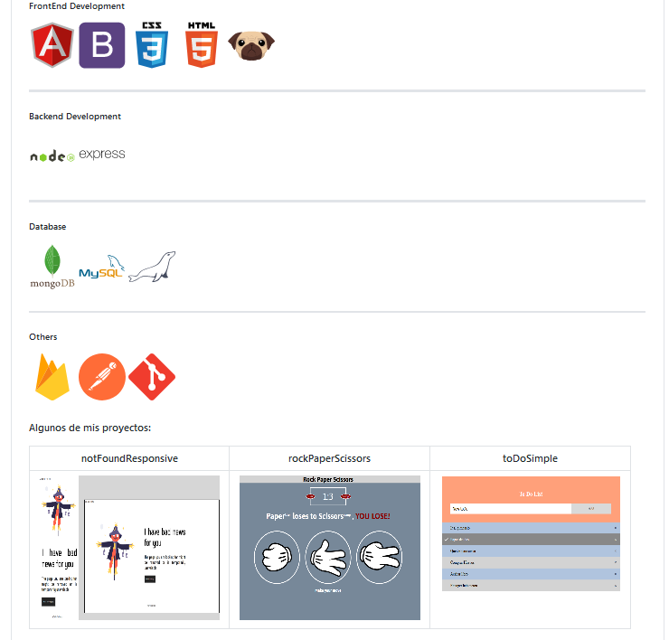

<!--  -->
## 👨‍💻 Hi What's up

<!--
## 🏡 Welcome! 👋 I hope my projects are to your liking :D
<span style="align:center"></span>

## 👨‍💻About me
> ***Bachelor's degree in Systems Engineering at the UPC and Degree in Computing & Information technology in Cibertec🎓🥇. I'm Rx Java 11 Programmer Back End - Angular & React Front End Developer and Azure DevOps. I have experience in technology companies in banking🏦, electronic invoicing🧾 and e-commerce 🛒***
***

## 🏗 My favorite Projects
```javascript
import health;
import happiness;
public class SecretOfLife{
  if(myHeartWorks){wishesToImprove=true;} 
  while(wishesToImprove){    
    push(passion);    
    push(curiosity);
    push(perseverance);
    time++;
  }  
  System.out.println("Life is very exciting!");
}
```

❶ Website for an IT Consulting Company: [Million Consulting](https://github.com/nicolasbncruz/upc) (HTML, CSS, Javascript, Bootstrap, Angular, Node JS)  
❷ CV Online Personal Website: [Profesional Java](https://github.com/nicolasbncruz/webpage) (HTML, CSS, Javascript, Bootstrap)  
❸ Fitness Mobile App: [Make It Better Project](https://github.com/nicolasbncruz/makeitbetter) (Java for Android, Firebase)  -->
<!---❹ My favorite search engine is [Duck Duck Go](https://duckduckgo.com)  
❺ My favorite search engine is [Duck Duck Go](https://duckduckgo.com)  esa ess
❻  
❼  
❽  
❾  
❿  
-->
## 🧰 My Skills
| ∯ | Language | Other - Framework - Library |
| --- | --- | --- |
| Front End |  |    |
| Back End   |         |      |

|  ∰ | Technologies - Tools |
| --- | --- |
| Cloud & DB |  |
| Knowledge |  |

<!--
 -->
## 📈 My statistics
|[](https://github.com/nicolasbncruz/github-readme-stats)||
<!--|---|---|<!--
-->
